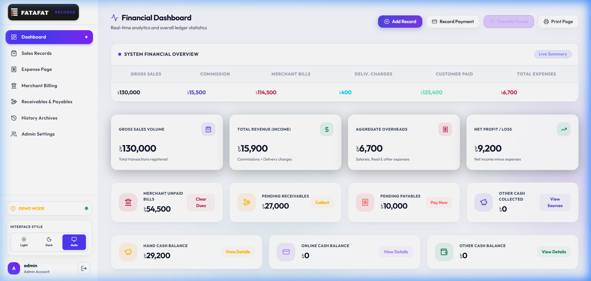

# 💼 Financial Records Manager (Fatafat Merchant Tracker)

A modern, high-performance financial management and bookkeeping web application designed for businesses, merchant logistics, and daily cash flow tracking. Features an ultra-sleek **Glassmorphism 2.0** interface with real-time Google Sheets backend synchronization via Google Apps Script.



---

## 🌟 Key Features

### 📊 1. Real-Time Financial Dashboard
- **Executive Metrics**: Instant KPI tracking for Gross Sales, Total Revenue (Commissions + Delivery), Aggregate Overheads, and Net Profit/Loss.
- **Financial Analytics Overview**: Structured summary table with live balances.
- **Expense Breakdown**: Visual distribution of Rider Salaries, Fixed Costs, and Miscellaneous Overheads.
- **Quick Fund Transfers**: Seamlessly transfer liquidity between **Hand Cash** and **Online Cash** accounts.
- **Printable Reports**: One-click printable financial statements formatted for thermal and standard document printing.

### 🛍️ 2. Sales Records Management
- **Transaction Logging**: Record date, merchant, sales amount, commission %, discounts, delivery charges, customer payment, and payment method (Cash / Online).
- **Auto-Calculations**: Automatic computation of merchant bills, commission deductions, and net customer payments.
- **Advanced Filtering**: Filter records by month, sales type, merchant name, or rider.

### 💰 3. Receivables & Payables Ledger
- **Receivables (Money to Receive)**:
  - Track receivables from clients and businesses.
  - One-click **"Receive"** action deposits the money directly into Hand Cash, Online Cash, or Other Cash balances.
- **Payables (Debts & Supplier Dues)**:
  - Track debts owed to suppliers, individuals, or vendors.
  - Dedicated **"Pay Now"** button: Prompts for confirmation, allows choosing the payment source, and automatically deducts the amount from the chosen cash balance.
  - Double-payment prevention safeguard with status indicators (`Paid` vs `Unpaid`).

### 🏛️ 4. Merchant Billing & Payouts
- Track pending bills per merchant.
- Record payouts to suppliers and clear outstanding debts with audit trails.

### 🧾 5. Expense Tracking & Overheads
- Categorized expense logging (Rider salaries, utilities, rent, and overheads).
- Direct impact on net profit and operational cash balance.

### 📜 6. History Archives & Admin Panel
- Comprehensive audit trails for transactions, transfers, and settlements.
- Role-based access control (Admin / Standard User).
- Live Google Sheets ledger synchronization with status indicators.

### 🎨 7. Modern UI / UX Design
- **Glassmorphism 2.0 Aesthetic**: Multi-layered backdrop blur, luminous inset highlights, and neon ambient glow.
- **Theme Support**: Seamless switching between **Dark Mode**, **Light Mode**, and **System Auto**.
- **Modern Tables & Badges**: Clean `.modern-table` layout with status pills (`.badge-pill`).

---

## 🛠️ Technology Stack

- **Frontend Framework**: [React 19](https://react.dev/) + [Vite](https://vitejs.dev/)
- **Styling**: [Tailwind CSS v4](https://tailwindcss.com/) with `@theme` design tokens and Vanilla CSS Glassmorphism 2.0
- **Icons**: [Lucide React](https://lucide.dev/)
- **Date Utilities**: [date-fns](https://date-fns.org/) & [react-datepicker](https://reactdatepicker.com/)
- **Notifications**: [React-Toastify](https://fkhadra.github.io/react-toastify/)
- **Backend & Database**: Google Apps Script (`Code.gs`) connected to Google Sheets

---

## 🚀 Getting Started

### Prerequisites
- [Node.js](https://nodejs.org/) (version 18+ recommended)
- npm or yarn

### Installation
1. Clone or open the repository:
   ```bash
   cd "d:/ab/financial record"
   ```

2. Install dependencies:
   ```bash
   npm install
   ```

3. Configure Environment Variables:
   Create or verify your `.env` file in the root directory:
   ```env
   VITE_API_URL=https://script.google.com/macros/s/YOUR_APPS_SCRIPT_DEPLOYMENT_ID/exec
   ```

4. Start Local Development Server:
   ```bash
   npm run dev
   ```
   Open `http://localhost:5173` in your browser.

5. Production Build:
   ```bash
   npm run build
   ```

---

## 📁 Project Structure

```
financial-record/
├── Code.gs                   # Google Apps Script backend code (Sheet API endpoints)
├── index.html                # Main HTML entry point
├── package.json              # Dependencies and build scripts
├── vite.config.js            # Vite configuration
├── src/
│   ├── App.jsx               # Main state router, session management, and layout
│   ├── index.css             # Glassmorphism 2.0 styling, theme tokens, modern-table
│   ├── assets/               # Logos and static media
│   ├── components/
│   │   ├── AdminPanel.jsx          # User management and admin settings
│   │   ├── BillingManager.jsx      # Merchant payout and dues management
│   │   ├── BillReminderManager.jsx # Automatic payout alerts
│   │   ├── Dashboard.jsx           # Financial overview, charts, and KPI cards
│   │   ├── ExpenseManager.jsx      # Overheads and rider salaries
│   │   ├── HistoryManager.jsx      # Archives and transfer logs
│   │   ├── Login.jsx               # Authentication gate
│   │   ├── OverheadExpenses.jsx    # Overhead summary widget
│   │   ├── ReceivableManager.jsx   # Receivables & Payables dual ledger
│   │   ├── SalesManager.jsx        # Sales transaction entries and table
│   │   └── Sidebar.jsx             # Navigation drawer and theme toggler
│   └── utils/
│       ├── api.js            # API layer connecting to Google Apps Script
│       └── finance.js        # Net cash balance and ledger math algorithms
└── tests/                    # Unit and integration test suites
```

---

## 📖 English Quick Guide (User Manual)

### 1. 📊 Financial Dashboard
- **Monitor Executive KPIs**: View Gross Sales Volume, Total Revenue (commissions + delivery), Total Overheads, and Net Profit/Loss.
- **System Overview**: Check live totals across gross sales, merchant bills, customer payments, and operational expenses.
- **Fund Transfer**: Click **"Transfer Funds"** to easily move money between **Hand Cash** and **Online Cash** (e.g. depositing collected physical cash into a bank or mobile wallet).
- **Printable Reports**: Click **"Print Page"** to generate a clean, print-ready document formatted for audits and records.

### 2. 🛍️ Sales Records
- **Add New Entry**: Click **"+ New Entry"** to open the side drawer form.
- **Form Inputs**: Enter transaction date & time, cycle month, merchant name, sales amount, commission %, discounts, and delivery charges.
- **Payment Method**: Specify whether the customer paid in **Cash** or via digital methods (**bKash**, **Nagad**, **Bank**, etc.).
- **Search & Filters**: Toggle **"Filters"** to isolate transactions by month, transaction type, or keywords (rider or merchant).

### 3. 📥 Receivables (Money You Will Receive)
- **Add Record**: Navigate to the **"Receivables & Payables"** page, select the **"Receivables"** subtab, and click **"+ Add Receivable"**.
- **Record Information**: Enter the debtor/client name, expected amount, due date, and optional notes.
- **Mark as Received**: When the money is collected, click the green **"Receive"** button. Select the target deposit account (**Hand Cash**, **Online Cash**, or **Other Cash**). The balance will instantly update.

### 4. 📤 Payables (Debts & Money You Owe)
- **Add Debt Record**: On the **"Receivables & Payables"** page, switch to the **"Payables"** subtab and click **"+ Add Payable"**.
- **Record Information**: Enter the supplier or person name, amount owed, date, and description. Status is initially set to **Unpaid**.
- **Settle Debt ("Pay Now")**: Click the red **"Pay Now"** button next to any unpaid row. Confirm the prompt and select which cash balance will fund the payment. The amount is deducted from the selected cash account and marked **Paid** (with double-payment prevention).

### 5. 🏛️ Merchant Billing & Payouts
- **Track Dues**: Open **"Merchant Billing"** to inspect outstanding liabilities per merchant partner.
- **Record Payout**: Click **"Record Payment"** to log merchant bill settlements and reduce outstanding balances.

### 6. 🎨 Theme & Interface Style
- In the lower section of the sidebar, find the **Interface Style** panel.
- Choose **Light**, **Dark**, or **Auto** (which synchronizes with your device's system appearance).

---

## 🇧🇩 সংক্ষেপে নির্দেশিকা (বাংলায়)

- **সেলস রেকর্ড**: দৈনিক বিক্রয়, ডিসকাউন্ট, ডেলিভারি চার্জ এবং কাস্টমার পেমেন্ট এন্ট্রি করুন।
- **রিসিভেবল (Receivables)**: কারও কাছ থেকে টাকা পাওয়ার থাকলে এন্ট্রি করুন। টাকা পাওয়ার পর **Receive** বাটনে ক্লিক করলে তা সরাসরি ক্যাশ ব্যালেন্সে জমা হবে।
- **পেয়াবল (Payables)**: সাপ্লায়ার বা কারো দেনা থাকলে এন্ট্রি করুন। টাকা পরিশোধ করলে **Pay Now** বাটনে ক্লিক করে সংশ্লিষ্ট ব্যালেন্স (Hand Cash/Online Cash) থেকে পরিশোধ করুন (টাকা স্বয়ংক্রিয়ভাবে বিয়োগ হবে)।
- **ট্রান্সফার (Fund Transfer)**: হ্যান্ড ক্যাশ থেকে অনলাইন ক্যাশ বা উল্টোভাবে ফান্ড ট্রান্সফার করুন।
- **থিম পরিবর্তন**: সাইডবারের নিচে থাকা সুইচ দিয়ে লাইট বা ডার্ক মোড বেছে নিন।
